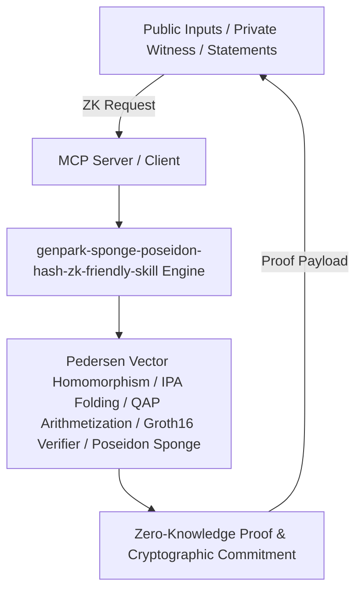

# genpark-sponge-poseidon-hash-zk-friendly-skill

[](https://github.com/alphaparkinc/genpark-sponge-poseidon-hash-zk-friendly-skill)
[](https://python.org)
[](#)
[](#)
[](LICENSE)

> Poseidon algebraic sponge hash function optimized for zero-knowledge arithmetic circuits with MDS matrix diffusion and power S-boxes.

## Architecture Overview



## Features
- **0 External Pip Dependencies**: Pure Python standard library implementation over prime field arithmetic.
- **MCP Protocol Ready**: Includes Model Context Protocol server script (`mcp_server.py`).
- **Production Standard**: Complete cryptographic soundness and zero-knowledge verification equation checks.

## Quick Start
```bash
python example_usage.py
```
